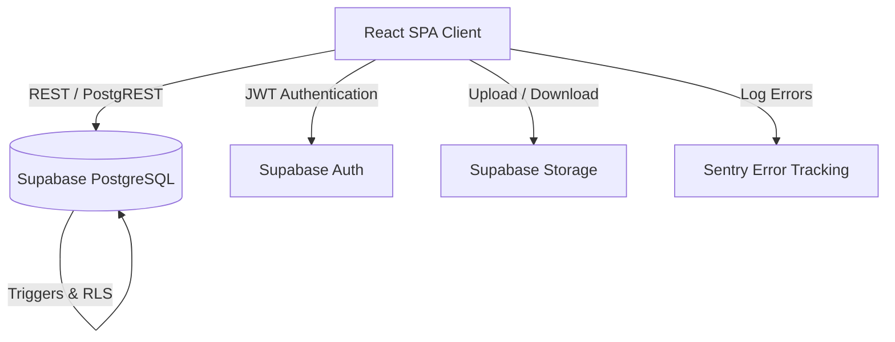

# Arsitektur Sistem Barventis

Dokumen ini mendeskripsikan arsitektur teknis dari **Barventis** — Sistem Manajemen Inventaris dan HPP (COGS) Restoran Multi-Tenant. 

---

## 1. Arsitektur High-Level (C4 Model - Context)

Barventis menggunakan arsitektur **Serverless Backend-as-a-Service (BaaS)** dengan Supabase sebagai *Single Source of Truth*.



**Komponen Utama:**
1. **Frontend:** React 19 + Vite + Tailwind CSS.
2. **Backend/Database:** PostgreSQL via Supabase. Seluruh *business logic* yang kritis (seperti pemotongan stok) berada di dalam fungsi **RPC (Remote Procedure Call)** untuk menjaga *atomicity*.
3. **Storage:** Digunakan untuk menyimpan Backup JSON Tenant.
4. **Observability:** Sentry untuk error tracking dan GitHub Actions untuk CI/CD.

---

## 2. Multi-Tenancy & Keamanan Data (Row Level Security)

Sistem melayani banyak restoran dalam satu database tunggal (*Shared Database, Shared Schema*). Isolasi data dilakukan murni pada level baris (Row Level Security / RLS).

**Aturan RLS (Pola Utama):**
Setiap tabel yang dimiliki oleh restoran memiliki kolom `tenant_id`.
```sql
CREATE POLICY "tenant_isolation" ON public.tabel_nama 
FOR ALL 
USING (tenant_id = public.get_auth_tenant_id()) 
WITH CHECK (tenant_id = public.get_auth_tenant_id());
```

**Hierarki Role:**
- `Super Admin`: Dapat melihat seluruh data lintas-tenant (melewati RLS) untuk keperluan *maintenance*.
- `Admin / Owner`: Full access CRUD pada tenant mereka sendiri.
- `Staff / Kasir`: Akses terbatas (hanya mengelola POS dan Stock, tidak bisa mengakses Cost Control/Laporan Keuangan).

---

## 3. Database & Daftar RPC (Remote Procedure Calls)

Untuk mencegah kondisi balapan (*Race Conditions*) seperti *Time-Of-Check to Time-Of-Use* (TOCTOU), Barventis tidak pernah memperbarui stok (Inventory) langsung dari *Client-side*. Semua mutasi stok melewati RPC.

### Daftar RPC Kritis

| Nama Fungsi | Parameter | Deskripsi & Tujuan |
|---|---|---|
| `deduct_stock_atomic` | `p_material_id`, `p_deduct_qty` | Memotong stok di tabel `materials` secara aman. Mencegah *race condition* jika 2 kasir checkout bersamaan. (Qty positif = potong stok, Qty negatif = tambah stok). |
| `adjust_material_stock` | `p_material_id`, `p_tenant_id`, `p_type`, `p_location`, `p_qty` | Menyesuaikan stok secara manual via Stock Ledger (In/Out/Transfer). |
| `checkout_pos_atomic` | *JSON Order Data* | Menyimpan transaksi POS lengkap dan memotong stok dari resep dalam satu transaksi utuh (*Rollback* jika gagal). |
| `receive_invoice_atomic`| `p_invoice_id`, `p_tenant_id` | Mengubah status *Purchase Order* menjadi RECEIVED dan menambahkan stok barang ke gudang sentral otomatis. |
| `get_hpp_metrics` | `p_tenant_id`, `p_start_date`, `p_end_date` | Menghitung kalkulasi COGS, Revenue, dan Margin tanpa membebani browser client. |

---

## 4. Alur Sinkronisasi POS & COGS (ESB & Native)

Barventis memiliki 2 sumber transaksi:
1. **Native POS:** Kasir menggunakan fitur POS Terminal bawaan Barventis.
2. **ESB / Third-Party Upload:** Manager mengunggah file Excel `.xlsx` harian/bulanan.

### ESB Upload Workflow (Smart Sync)
1. **Parser & Validation:** Client mengurai file Excel, mendeteksi kolom `Menu Name` dan `Qty`.
2. **Missing Recipe Check:** Sistem mencari *Menu Name* di tabel `recipes`. Jika tidak ada, fallback mencari di tabel `materials` (untuk skema 1-to-1 seperti Minuman Kemasan).
3. **Anti-Duplicate & Rollback:** Jika data di periode yang sama sudah ada, sistem menawarkan fitur **Overwrite**. Sistem memanggil RPC untuk melakukan `refund` stok lama sebelum memotong stok baru.
4. **Auto-Deduct:** Menghitung `Qty * Recipe Ingredients` dan memanggil `deduct_stock_atomic`.
5. **Cost Calculation (COGS):** Total *Theoretical Cost* dicatat berdasarkan *Unit Price* hari itu untuk melindungi histori HPP dari perubahan harga bahan baku di masa depan.

---

## 5. Sistem Audit Trail (Immutability)

Semua aksi krusial pengguna dicatat secara diam-diam oleh *Database Triggers* untuk mencegah kecurangan/manipulasi oleh *insider*:

1. **Trigger `fn_audit_trigger`**: Terpasang di tabel `materials`, `recipes`, `invoices`, `purchase_entries`, dll. Trigger ini menyalin status data *sebelum* (OLD) dan *sesudah* (NEW) diubah.
2. **Immutability Constraint**: Terdapat trigger pelindung `fn_block_audit_mutation` pada tabel `audit_logs` yang secara mutlak menolak query `UPDATE` atau `DELETE`. Baris log yang sudah masuk tidak dapat diubah oleh siapapun (bahkan oleh Super Admin).

---

## 6. Integrasi Ekspor Data (Laporan)

Semua laporan finansial dan stok diekspor menggunakan modul terpadu di `src/services/export/`.
- **Excel:** Diolah dengan `xlsx` via `excelExporter.js`.
- **PDF:** Digenerate menggunakan `jspdf` dan `jspdf-autotable` via `pdfExporter.js` (lengkap dengan *pagination* dan *watermark* konfidensial).
Setiap ekspor data finansial akan memicu log audit (*Exporting Sensitive Data*).

---
*Dokumen ini dibuat secara otomatis pada iterasi pembenahan Fase 3 Barventis.*