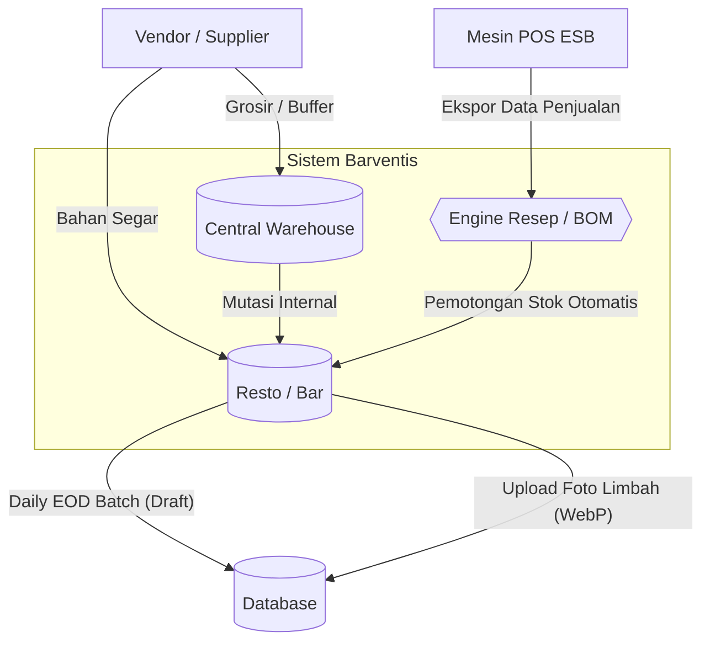
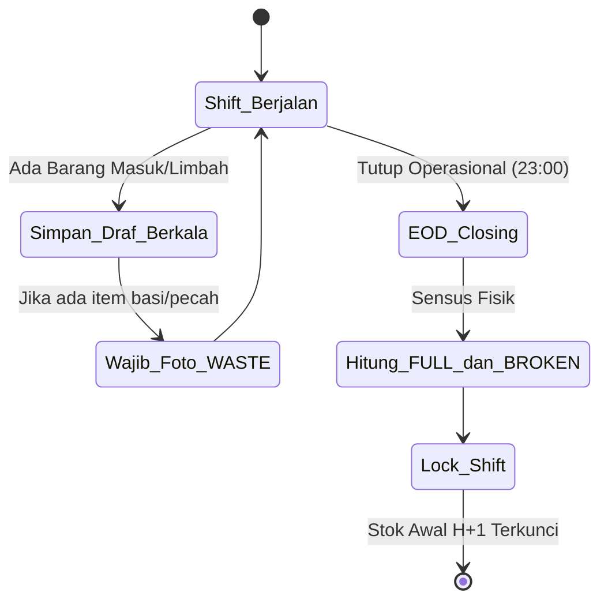

# Arsitektur & Alur Bisnis Barventis (TO-BE)

## 1. Arsitektur Logistik & Inventaris

## 2. Alur Kerja Harian Barista (Closing Shift)

## Dokumen Terkait
- [[business_goals|Business Goals]]
- [[gap_analysis|Gap Analysis]]
- [[business_process_discovery_barventis_13_sheets|BPD 13 Sheets]]
- [[master_roadmap|Roadmap Implementasi]]
